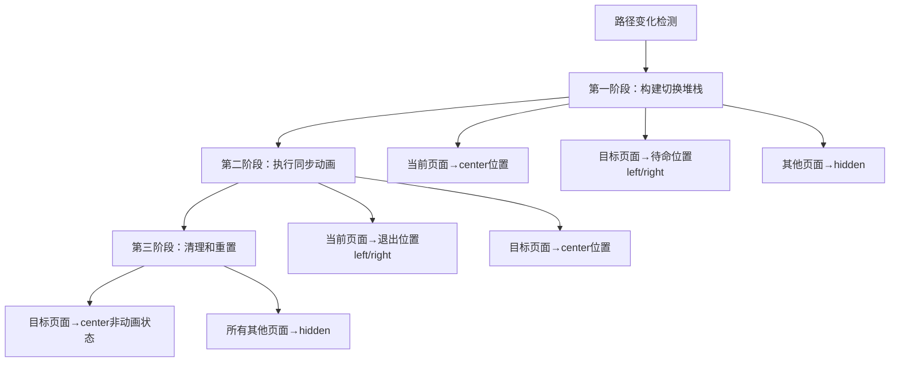

# 页面切换系统技术文档

## 概述

本系统实现了一个基于React的智能页面切换机制，支持流畅的动画过渡、预缓存和基于页面顺序的动态导航方向。系统采用类似移动应用的体验设计，提供了从左到右或从右到左的平滑滑动动画。

## 核心原理

### 1. 页面顺序系统

系统定义了固定的页面顺序，每个页面都有唯一的数字标识：

```typescript
const PAGE_ORDER: Record<PageId, number> = {
  inbox: 1,      // 收件箱
  tasks: 2,      // 任务
  chat: 3,       // 聊天
  docs: 4,       // 文档
  settings: 5,   // 设置
};
```

**动画方向规则**：
- 当切换到**标号更大**的页面时：新页面从**右侧**滑入，当前页面向**左侧**滑出
- 当切换到**标号更小**的页面时：新页面从**左侧**滑入，当前页面向**右侧**滑出

### 2. 三层页面状态系统

每个页面在任意时刻都有一个明确的位置状态：

```typescript
interface PageState {
  id: PageId;
  position: "left" | "center" | "right" | "hidden";
  isAnimating: boolean;
}
```

- **`center`**: 当前可见页面，位于视口中央
- **`left`**: 左侧待命/退出页面，向左偏移100%
- **`right`**: 右侧待命/退出页面，向右偏移100%  
- **`hidden`**: 完全隐藏的页面，向左偏移200%

## 动画执行流程

### 三阶段动画系统



#### 第一阶段：构建切换堆栈 (0ms)
```typescript
// 确定动画方向
const isForward = toOrder > fromOrder;

// 设置初始位置
if (fromPageId) {
  newStates[fromPageId].position = "center";  // 当前页面在中央
}

if (isForward) {
  newStates[toPageId].position = "right";     // 目标页面在右侧等待
} else {
  newStates[toPageId].position = "left";      // 目标页面在左侧等待
}
```

#### 第二阶段：执行同步动画 (16ms后启动)
```typescript
setTimeout(() => {
  if (fromPageId) {
    if (isForward) {
      newStates[fromPageId].position = "left";   // 当前页面向左退出
    } else {
      newStates[fromPageId].position = "right";  // 当前页面向右退出
    }
  }
  
  newStates[toPageId].position = "center";       // 目标页面滑入中央
}, 16); // 下一帧开始动画
```

#### 第三阶段：清理和重置 (300ms后完成)
```typescript
setTimeout(() => {
  // 只保留当前页面，重置动画状态
  Object.keys(newStates).forEach((id) => {
    if (id === toPageId) {
      newStates[id].position = "center";
      newStates[id].isAnimating = false;
    } else {
      newStates[id].position = "hidden";
      newStates[id].isAnimating = false;
    }
  });
}, 300); // 等待CSS动画完成
```

## 技术架构

### 组件层次结构

```
Layout.tsx                    # 主布局，控制缓存页面显示/隐藏
├── GlobalPageCache.tsx       # 页面切换管理器
    ├── PageRenderer         # 页面渲染器组件
    │   ├── CachedInboxPage
    │   ├── CachedTasksPage  
    │   ├── CachedChatPage
    │   ├── CachedDocsPage
    │   └── CachedSettingsPage
    └── ContextMenuWrapper   # 右键菜单包装器
```

### 核心组件设计

#### 1. GlobalPageCache (主控制器)

```typescript
export const GlobalPageCache = React.memo(() => {
  const pathname = usePathname();
  const [currentPageId, setCurrentPageId] = useState<PageId | null>();
  const [pageStates, setPageStates] = useState<Record<PageId, PageState>>();
  
  // 路径监听 → 触发页面切换
  useEffect(() => {
    const newPageId = getPageIdFromPath(pathname);
    if (newPageId && newPageId !== currentPageId) {
      performTransition(currentPageId, newPageId);
      setCurrentPageId(newPageId);
    }
  }, [pathname, currentPageId, performTransition]);
});
```

**核心职责**：
- 监听路径变化
- 管理页面状态
- 编排动画流程
- 内存清理

#### 2. PageRenderer (渲染器)

```typescript
const PageRenderer = React.memo(({ state }: { state: PageState }) => {
  if (state.position === "hidden") {
    return null; // 性能优化：隐藏页面不渲染
  }

  const PageComponent = PAGE_COMPONENTS[state.id];
  const style = getPageStyle(state);

  return (
    <div style={style}>
      <PageComponent />
    </div>
  );
});
```

**核心职责**：
- 根据状态渲染页面
- 应用CSS变换样式
- 性能优化（条件渲染）

### CSS样式系统

#### 位置样式映射

```typescript
const getPageStyle = (state: PageState): React.CSSProperties => {
  const baseStyle = {
    position: "absolute",
    inset: 0,
    transition: state.isAnimating ? "transform 300ms ease-in-out" : "none",
  };

  switch (state.position) {
    case "left":   return { ...baseStyle, transform: "translateX(-100%)", zIndex: 5 };
    case "center": return { ...baseStyle, transform: "translateX(0%)", zIndex: 10 };
    case "right":  return { ...baseStyle, transform: "translateX(100%)", zIndex: 5 };
    case "hidden": return { ...baseStyle, transform: "translateX(-200%)", zIndex: 1 };
  }
};
```

#### Z-Index层级管理

- **中央页面 (zIndex: 10)**: 最高优先级，始终在最前
- **左右页面 (zIndex: 5)**: 动画参与者，次级优先级  
- **隐藏页面 (zIndex: 1)**: 最低优先级，完全隐藏

## 状态管理策略

### 完全自包含设计

系统采用**零外部依赖**的状态管理策略：

```typescript
// ❌ 避免：外部store依赖（会导致循环更新）
const { showPage, hidePage, currentVisiblePage } = usePageCacheStore();

// ✅ 推荐：内部状态管理
const [currentPageId, setCurrentPageId] = useState<PageId | null>();
const [pageStates, setPageStates] = useState<Record<PageId, PageState>>();
```

**优势**：
- 避免循环依赖
- 性能优化
- 调试简单
- 状态可预测

### Layout组件集成

```typescript
// Layout.tsx - 简化的显示逻辑
const isCachedPage = (pathname: string) => {
  return pathname.includes("/docs") || 
         pathname.includes("/inbox") || 
         pathname.includes("/settings") || 
         pathname.includes("/chat") ||
         pathname.includes("/tasks");
};

const showCachedPage = isCachedPage(pathname); // 直接根据路径判断
```

## 性能优化策略

### 1. 渲染优化

```typescript
// 条件渲染：隐藏页面不参与DOM
if (state.position === "hidden") {
  return null;
}

// React.memo：防止不必要的重渲染
const PageRenderer = React.memo(({ state }) => { ... });
const GlobalPageCache = React.memo(() => { ... });
```

### 2. 动画优化

```typescript
// 硬件加速：使用transform而非位置属性
transform: "translateX(-100%)" // ✅ GPU加速
left: "-100%"                  // ❌ CPU布局重计算

// 智能过渡：只在动画期间启用transition
transition: state.isAnimating ? "transform 300ms ease-in-out" : "none"
```

### 3. 内存管理

```typescript
// 超时清理：防止内存泄漏
useEffect(() => {
  return () => {
    if (animationTimeoutRef.current) {
      clearTimeout(animationTimeoutRef.current);
    }
  };
}, []);

// 状态重置：动画完成后清理临时状态
setTimeout(() => {
  // 重置所有页面到最终状态
}, 300);
```

## 问题解决历程

### 原始问题：无限循环

**症状**：
- 浏览器疯狂重新加载
- JavaScript堆内存溢出
- 页面切换卡顿

**根本原因**：
```typescript
// ❌ 问题代码：循环依赖
useEffect(() => {
  if (newPageId !== currentVisiblePage) {
    showPage(newPageId);  // 更新store
  }
}, [pathname, currentVisiblePage, showPage]); // currentVisiblePage变化触发重新执行
```

**解决方案**：
```typescript
// ✅ 修复代码：内部状态管理
useEffect(() => {
  const newPageId = getPageIdFromPath(pathname);
  if (newPageId && newPageId !== currentPageId) {
    performTransition(currentPageId, newPageId);
    setCurrentPageId(newPageId);  // 仅更新内部状态
  }
}, [pathname, currentPageId, performTransition]); // 清晰的依赖关系
```

### 其他关键修复

1. **防止store重复初始化**
```typescript
let isInitialized = false;
if (typeof window !== "undefined" && !isInitialized) {
  isInitialized = true;
  // 初始化逻辑
}
```

2. **依赖数组优化**
```typescript
const performTransition = useCallback((from, to) => {
  // 动画逻辑
}, [setPageStates]); // 明确依赖关系
```

## 扩展指南

### 添加新页面

1. **定义页面组件**
```typescript
// src/components/cache/pages/CachedNewPage.tsx
export const CachedNewPage = React.memo(() => {
  return <div>新页面内容</div>;
});
```

2. **注册页面映射**
```typescript
const PAGE_COMPONENTS = {
  // ... 现有页面
  newpage: CachedNewPage,
};

const PAGE_ORDER = {
  // ... 现有顺序
  newpage: 6, // 新的序号
};
```

3. **添加路径匹配**
```typescript
const getPageIdFromPath = (pathname: string): PageId | null => {
  // ... 现有匹配
  if (pathname.includes("/newpage")) return "newpage";
  return null;
};
```

### 自定义动画

```typescript
// 修改动画时长
transition: state.isAnimating ? "transform 500ms ease-in-out" : "none"

// 添加不同的缓动函数
transition: state.isAnimating ? "transform 300ms cubic-bezier(0.4, 0, 0.2, 1)" : "none"

// 垂直动画支持
transform: `translateY(${getVerticalOffset(state.position)}%)`
```

## 最佳实践

### 1. 状态管理
- ✅ 使用内部状态，避免外部store循环依赖
- ✅ 明确useEffect依赖数组
- ✅ 及时清理副作用（setTimeout、interval等）

### 2. 性能优化  
- ✅ 使用React.memo防止不必要重渲染
- ✅ 条件渲染隐藏组件
- ✅ 使用transform实现动画（GPU加速）

### 3. 代码组织
- ✅ 单一职责：每个组件专注特定功能
- ✅ 类型安全：完整的TypeScript类型定义
- ✅ 可读性：清晰的命名和注释

## 总结

本页面切换系统通过精心设计的三阶段动画流程、智能的状态管理和高效的性能优化，实现了媲美原生应用的页面切换体验。系统具有良好的扩展性和维护性，为复杂的单页应用提供了稳定可靠的导航解决方案。 